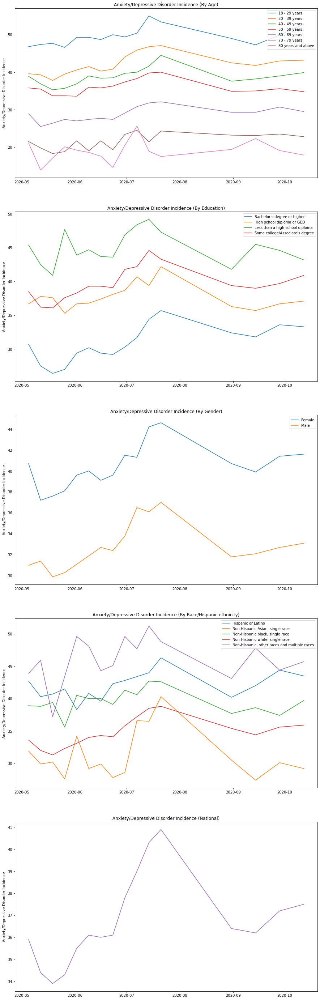
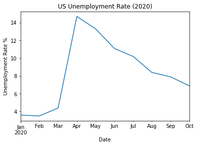
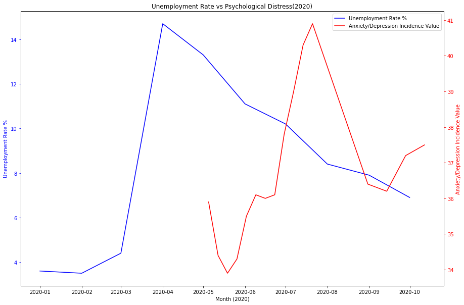
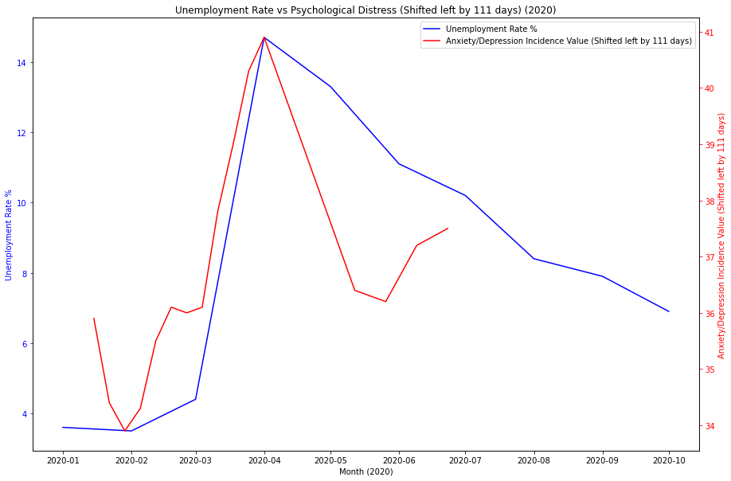

# COVID-19 Psychological Effects Analysis
### Author: Jace Kline

## Abstract
In this notebook, we center our analysis around the psychological impacts that the coronavirus has had on people in the United States. Specifically, we focus on the incidence of anxiety and/or depression amongst different population groups and states in the US. The primary data set is accessible at https://data.cdc.gov/NCHS/Indicators-of-Anxiety-or-Depression-Based-on-Repor/8pt5-q6wp. 

In addition to psychological trends seen amongst different population groups in the US, we also utilize US unemployment data to show visualizations that relate the unemployment rate to the incidence of anxiety and depression in the US. For this data, we use the data set accessible at https://fred.stlouisfed.org/series/UNRATE.

## Imports


```python
# General imports
import os
import re
import numpy as np
import pandas as pd
from matplotlib import pyplot as plt
import seaborn as sns
%matplotlib inline
```


```python
# Import data
initial_data = '../data/initial/'

# Import dataset
df = pd.read_csv(initial_data + 'covid-anxiety-depression.csv')
```

## Data Cleaning


```python
# Change the "National Estimate" group to be "By State" for consistency
df.Group = df.Group.apply(lambda g: 'By State' if g == 'National Estimate' else g)
```


```python
# Drop records with NaN 'Value' -> when 'Phase = -1'
df = df[df.Phase != -1]
df
```


<div>
<table border="1" class="dataframe">
  <thead>
    <tr style="text-align: right;">
      <th></th>
      <th>Phase</th>
      <th>Indicator</th>
      <th>Group</th>
      <th>State</th>
      <th>Subgroup</th>
      <th>Time Period</th>
      <th>Time Period Label</th>
      <th>Value</th>
      <th>Low CI</th>
      <th>High CI</th>
      <th>Confidence Interval</th>
      <th>Quartile range</th>
    </tr>
  </thead>
  <tbody>
    <tr>
      <th>0</th>
      <td>1</td>
      <td>Symptoms of Depressive Disorder</td>
      <td>By State</td>
      <td>United States</td>
      <td>United States</td>
      <td>1</td>
      <td>Apr 23 - May 5</td>
      <td>23.5</td>
      <td>22.7</td>
      <td>24.3</td>
      <td>22.7 - 24.3</td>
      <td>NaN</td>
    </tr>
    <tr>
      <th>1</th>
      <td>1</td>
      <td>Symptoms of Depressive Disorder</td>
      <td>By Age</td>
      <td>United States</td>
      <td>18 - 29 years</td>
      <td>1</td>
      <td>Apr 23 - May 5</td>
      <td>32.7</td>
      <td>30.2</td>
      <td>35.2</td>
      <td>30.2 - 35.2</td>
      <td>NaN</td>
    </tr>
    <tr>
      <th>2</th>
      <td>1</td>
      <td>Symptoms of Depressive Disorder</td>
      <td>By Age</td>
      <td>United States</td>
      <td>30 - 39 years</td>
      <td>1</td>
      <td>Apr 23 - May 5</td>
      <td>25.7</td>
      <td>24.1</td>
      <td>27.3</td>
      <td>24.1 - 27.3</td>
      <td>NaN</td>
    </tr>
    <tr>
      <th>3</th>
      <td>1</td>
      <td>Symptoms of Depressive Disorder</td>
      <td>By Age</td>
      <td>United States</td>
      <td>40 - 49 years</td>
      <td>1</td>
      <td>Apr 23 - May 5</td>
      <td>24.8</td>
      <td>23.3</td>
      <td>26.2</td>
      <td>23.3 - 26.2</td>
      <td>NaN</td>
    </tr>
    <tr>
      <th>4</th>
      <td>1</td>
      <td>Symptoms of Depressive Disorder</td>
      <td>By Age</td>
      <td>United States</td>
      <td>50 - 59 years</td>
      <td>1</td>
      <td>Apr 23 - May 5</td>
      <td>23.2</td>
      <td>21.5</td>
      <td>25.0</td>
      <td>21.5 - 25.0</td>
      <td>NaN</td>
    </tr>
    <tr>
      <th>...</th>
      <td>...</td>
      <td>...</td>
      <td>...</td>
      <td>...</td>
      <td>...</td>
      <td>...</td>
      <td>...</td>
      <td>...</td>
      <td>...</td>
      <td>...</td>
      <td>...</td>
      <td>...</td>
    </tr>
    <tr>
      <th>3412</th>
      <td>2</td>
      <td>Symptoms of Anxiety Disorder or Depressive Dis...</td>
      <td>By State</td>
      <td>Virginia</td>
      <td>Virginia</td>
      <td>16</td>
      <td>Sep 30 - Oct 12</td>
      <td>32.9</td>
      <td>29.9</td>
      <td>36.0</td>
      <td>29.9 - 36.0</td>
      <td>27.8-34.3</td>
    </tr>
    <tr>
      <th>3413</th>
      <td>2</td>
      <td>Symptoms of Anxiety Disorder or Depressive Dis...</td>
      <td>By State</td>
      <td>Washington</td>
      <td>Washington</td>
      <td>16</td>
      <td>Sep 30 - Oct 12</td>
      <td>38.5</td>
      <td>35.4</td>
      <td>41.8</td>
      <td>35.4 - 41.8</td>
      <td>36.7-38.8</td>
    </tr>
    <tr>
      <th>3414</th>
      <td>2</td>
      <td>Symptoms of Anxiety Disorder or Depressive Dis...</td>
      <td>By State</td>
      <td>West Virginia</td>
      <td>West Virginia</td>
      <td>16</td>
      <td>Sep 30 - Oct 12</td>
      <td>42.8</td>
      <td>37.0</td>
      <td>48.7</td>
      <td>37.0 - 48.7</td>
      <td>38.9-44.0</td>
    </tr>
    <tr>
      <th>3415</th>
      <td>2</td>
      <td>Symptoms of Anxiety Disorder or Depressive Dis...</td>
      <td>By State</td>
      <td>Wisconsin</td>
      <td>Wisconsin</td>
      <td>16</td>
      <td>Sep 30 - Oct 12</td>
      <td>34.5</td>
      <td>30.9</td>
      <td>38.3</td>
      <td>30.9 - 38.3</td>
      <td>34.4-36.6</td>
    </tr>
    <tr>
      <th>3416</th>
      <td>2</td>
      <td>Symptoms of Anxiety Disorder or Depressive Dis...</td>
      <td>By State</td>
      <td>Wyoming</td>
      <td>Wyoming</td>
      <td>16</td>
      <td>Sep 30 - Oct 12</td>
      <td>33.1</td>
      <td>27.3</td>
      <td>39.4</td>
      <td>27.3 - 39.4</td>
      <td>27.8-34.3</td>
    </tr>
  </tbody>
</table>
<p>3360 rows × 12 columns</p>
</div>


```python
def toMonthNum(m):
    d = {'Jan': 1, 
         'Feb': 2,
         'Mar': 3,
         'Apr': 4,
         'May': 5,
         'June': 6,
         'July': 7,
         'Aug': 8,
         'Sep': 9,
         'Oct': 10,
         'Nov': 11,
         'Dec': 12}
    return d[m]
```


```python
def split_time_period(s):
    regex = '([A-Z][a-z]*)\s([1-9][0-9]?)\s-\s([A-Z][a-z]*)\s([1-9][0-9]?)'
    m = re.match(regex, s)
    if m is not None:
        return ('{}-{}-2020'.format(toMonthNum(m[1]), int(m[2])),
                '{}-{}-2020'.format(toMonthNum(m[3]), int(m[4])))
    else:
        return np.nan
```

### Splitting the 'Time Period Label' into start and end components

By splitting this attribute into a start and end, we can more effectively group and index the data based on time. This will ultimately allow us to utilize the Pandas DateTime datatype after our transformation.


```python
# Split the 'Time Period Label' into 'Time Period Start' and 'Time Period End'
splits = df['Time Period Label'].apply(split_time_period)
df_splits = pd.DataFrame(splits.tolist(), columns=['Time Period Start', 'Time Period End'])
df_splits.index = df.index
df_splits['Time Period Label'] = df['Time Period Label']
df_splits['Time Period Start'] = pd.to_datetime(df_splits['Time Period Start'])
df_splits['Time Period End'] = pd.to_datetime(df_splits['Time Period End'])
df_splits
```


<div>
<table border="1" class="dataframe">
  <thead>
    <tr style="text-align: right;">
      <th></th>
      <th>Time Period Start</th>
      <th>Time Period End</th>
      <th>Time Period Label</th>
    </tr>
  </thead>
  <tbody>
    <tr>
      <th>0</th>
      <td>2020-04-23</td>
      <td>2020-05-05</td>
      <td>Apr 23 - May 5</td>
    </tr>
    <tr>
      <th>1</th>
      <td>2020-04-23</td>
      <td>2020-05-05</td>
      <td>Apr 23 - May 5</td>
    </tr>
    <tr>
      <th>2</th>
      <td>2020-04-23</td>
      <td>2020-05-05</td>
      <td>Apr 23 - May 5</td>
    </tr>
    <tr>
      <th>3</th>
      <td>2020-04-23</td>
      <td>2020-05-05</td>
      <td>Apr 23 - May 5</td>
    </tr>
    <tr>
      <th>4</th>
      <td>2020-04-23</td>
      <td>2020-05-05</td>
      <td>Apr 23 - May 5</td>
    </tr>
    <tr>
      <th>...</th>
      <td>...</td>
      <td>...</td>
      <td>...</td>
    </tr>
    <tr>
      <th>3412</th>
      <td>2020-09-30</td>
      <td>2020-10-12</td>
      <td>Sep 30 - Oct 12</td>
    </tr>
    <tr>
      <th>3413</th>
      <td>2020-09-30</td>
      <td>2020-10-12</td>
      <td>Sep 30 - Oct 12</td>
    </tr>
    <tr>
      <th>3414</th>
      <td>2020-09-30</td>
      <td>2020-10-12</td>
      <td>Sep 30 - Oct 12</td>
    </tr>
    <tr>
      <th>3415</th>
      <td>2020-09-30</td>
      <td>2020-10-12</td>
      <td>Sep 30 - Oct 12</td>
    </tr>
    <tr>
      <th>3416</th>
      <td>2020-09-30</td>
      <td>2020-10-12</td>
      <td>Sep 30 - Oct 12</td>
    </tr>
  </tbody>
</table>
<p>3360 rows × 3 columns</p>
</div>


```python
# Add the split time period columns back to the original dataframe
df[['Time Period Start', 'Time Period End']] = df_splits[['Time Period Start', 'Time Period End']]
df
```


<div>
<table border="1" class="dataframe">
  <thead>
    <tr style="text-align: right;">
      <th></th>
      <th>Phase</th>
      <th>Indicator</th>
      <th>Group</th>
      <th>State</th>
      <th>Subgroup</th>
      <th>Time Period</th>
      <th>Time Period Label</th>
      <th>Value</th>
      <th>Low CI</th>
      <th>High CI</th>
      <th>Confidence Interval</th>
      <th>Quartile range</th>
      <th>Time Period Start</th>
      <th>Time Period End</th>
    </tr>
  </thead>
  <tbody>
    <tr>
      <th>0</th>
      <td>1</td>
      <td>Symptoms of Depressive Disorder</td>
      <td>By State</td>
      <td>United States</td>
      <td>United States</td>
      <td>1</td>
      <td>Apr 23 - May 5</td>
      <td>23.5</td>
      <td>22.7</td>
      <td>24.3</td>
      <td>22.7 - 24.3</td>
      <td>NaN</td>
      <td>2020-04-23</td>
      <td>2020-05-05</td>
    </tr>
    <tr>
      <th>1</th>
      <td>1</td>
      <td>Symptoms of Depressive Disorder</td>
      <td>By Age</td>
      <td>United States</td>
      <td>18 - 29 years</td>
      <td>1</td>
      <td>Apr 23 - May 5</td>
      <td>32.7</td>
      <td>30.2</td>
      <td>35.2</td>
      <td>30.2 - 35.2</td>
      <td>NaN</td>
      <td>2020-04-23</td>
      <td>2020-05-05</td>
    </tr>
    <tr>
      <th>2</th>
      <td>1</td>
      <td>Symptoms of Depressive Disorder</td>
      <td>By Age</td>
      <td>United States</td>
      <td>30 - 39 years</td>
      <td>1</td>
      <td>Apr 23 - May 5</td>
      <td>25.7</td>
      <td>24.1</td>
      <td>27.3</td>
      <td>24.1 - 27.3</td>
      <td>NaN</td>
      <td>2020-04-23</td>
      <td>2020-05-05</td>
    </tr>
    <tr>
      <th>3</th>
      <td>1</td>
      <td>Symptoms of Depressive Disorder</td>
      <td>By Age</td>
      <td>United States</td>
      <td>40 - 49 years</td>
      <td>1</td>
      <td>Apr 23 - May 5</td>
      <td>24.8</td>
      <td>23.3</td>
      <td>26.2</td>
      <td>23.3 - 26.2</td>
      <td>NaN</td>
      <td>2020-04-23</td>
      <td>2020-05-05</td>
    </tr>
    <tr>
      <th>4</th>
      <td>1</td>
      <td>Symptoms of Depressive Disorder</td>
      <td>By Age</td>
      <td>United States</td>
      <td>50 - 59 years</td>
      <td>1</td>
      <td>Apr 23 - May 5</td>
      <td>23.2</td>
      <td>21.5</td>
      <td>25.0</td>
      <td>21.5 - 25.0</td>
      <td>NaN</td>
      <td>2020-04-23</td>
      <td>2020-05-05</td>
    </tr>
    <tr>
      <th>...</th>
      <td>...</td>
      <td>...</td>
      <td>...</td>
      <td>...</td>
      <td>...</td>
      <td>...</td>
      <td>...</td>
      <td>...</td>
      <td>...</td>
      <td>...</td>
      <td>...</td>
      <td>...</td>
      <td>...</td>
      <td>...</td>
    </tr>
    <tr>
      <th>3412</th>
      <td>2</td>
      <td>Symptoms of Anxiety Disorder or Depressive Dis...</td>
      <td>By State</td>
      <td>Virginia</td>
      <td>Virginia</td>
      <td>16</td>
      <td>Sep 30 - Oct 12</td>
      <td>32.9</td>
      <td>29.9</td>
      <td>36.0</td>
      <td>29.9 - 36.0</td>
      <td>27.8-34.3</td>
      <td>2020-09-30</td>
      <td>2020-10-12</td>
    </tr>
    <tr>
      <th>3413</th>
      <td>2</td>
      <td>Symptoms of Anxiety Disorder or Depressive Dis...</td>
      <td>By State</td>
      <td>Washington</td>
      <td>Washington</td>
      <td>16</td>
      <td>Sep 30 - Oct 12</td>
      <td>38.5</td>
      <td>35.4</td>
      <td>41.8</td>
      <td>35.4 - 41.8</td>
      <td>36.7-38.8</td>
      <td>2020-09-30</td>
      <td>2020-10-12</td>
    </tr>
    <tr>
      <th>3414</th>
      <td>2</td>
      <td>Symptoms of Anxiety Disorder or Depressive Dis...</td>
      <td>By State</td>
      <td>West Virginia</td>
      <td>West Virginia</td>
      <td>16</td>
      <td>Sep 30 - Oct 12</td>
      <td>42.8</td>
      <td>37.0</td>
      <td>48.7</td>
      <td>37.0 - 48.7</td>
      <td>38.9-44.0</td>
      <td>2020-09-30</td>
      <td>2020-10-12</td>
    </tr>
    <tr>
      <th>3415</th>
      <td>2</td>
      <td>Symptoms of Anxiety Disorder or Depressive Dis...</td>
      <td>By State</td>
      <td>Wisconsin</td>
      <td>Wisconsin</td>
      <td>16</td>
      <td>Sep 30 - Oct 12</td>
      <td>34.5</td>
      <td>30.9</td>
      <td>38.3</td>
      <td>30.9 - 38.3</td>
      <td>34.4-36.6</td>
      <td>2020-09-30</td>
      <td>2020-10-12</td>
    </tr>
    <tr>
      <th>3416</th>
      <td>2</td>
      <td>Symptoms of Anxiety Disorder or Depressive Dis...</td>
      <td>By State</td>
      <td>Wyoming</td>
      <td>Wyoming</td>
      <td>16</td>
      <td>Sep 30 - Oct 12</td>
      <td>33.1</td>
      <td>27.3</td>
      <td>39.4</td>
      <td>27.3 - 39.4</td>
      <td>27.8-34.3</td>
      <td>2020-09-30</td>
      <td>2020-10-12</td>
    </tr>
  </tbody>
</table>
<p>3360 rows × 14 columns</p>
</div>


## Data Organization and Exploration


```python
# Useful lists
groups = list(np.unique(df.Group))
indicators = list(np.unique(df.Indicator))
states = list(np.unique(df.State))
time_periods = list(np.unique(df['Time Period']))
time_labels = list(np.unique(df['Time Period Label']))
```

### Defining a 'Group' Class

This class represents a particular "view" of the data, centered around a particular group. The key attributes are the group label, the dataset, and the possible subgroup values that can be observed. For example, a group might be "By Education" and the subgroups would be "Bachelor's degree or higher", 'High school diploma or GED', 'Less than a high school diploma', and "Some college/Associate's degree".


```python
class Group:
    def __init__(self, df, group_label):
        self.group_label = group_label
        self.df = df[df.Group == self.group_label]
        self.subgroups = list(np.unique(self.df.Subgroup))
    def __repr__(self):
        return 'Group ({})'.format(self.group_label)
```


```python
group_objs = list(map(lambda g: Group(df, g), groups))
```


```python
for g in group_objs:
    print(g.group_label)
    print(g.subgroups)
    print('\n\n')
```

    By Age
    ['18 - 29 years', '30 - 39 years', '40 - 49 years', '50 - 59 years', '60 - 69 years', '70 - 79 years', '80 years and above']
    
    
    
    By Education
    ["Bachelor's degree or higher", 'High school diploma or GED', 'Less than a high school diploma', "Some college/Associate's degree"]
    
    
    
    By Gender
    ['Female', 'Male']
    
    
    
    By Race/Hispanic ethnicity
    ['Hispanic or Latino', 'Non-Hispanic Asian, single race', 'Non-Hispanic black, single race', 'Non-Hispanic white, single race', 'Non-Hispanic, other races and multiple races']
    
    
    
    By State
    ['Alabama', 'Alaska', 'Arizona', 'Arkansas', 'California', 'Colorado', 'Connecticut', 'Delaware', 'District of Columbia', 'Florida', 'Georgia', 'Hawaii', 'Idaho', 'Illinois', 'Indiana', 'Iowa', 'Kansas', 'Kentucky', 'Louisiana', 'Maine', 'Maryland', 'Massachusetts', 'Michigan', 'Minnesota', 'Mississippi', 'Missouri', 'Montana', 'Nebraska', 'Nevada', 'New Hampshire', 'New Jersey', 'New Mexico', 'New York', 'North Carolina', 'North Dakota', 'Ohio', 'Oklahoma', 'Oregon', 'Pennsylvania', 'Rhode Island', 'South Carolina', 'South Dakota', 'Tennessee', 'Texas', 'United States', 'Utah', 'Vermont', 'Virginia', 'Washington', 'West Virginia', 'Wisconsin', 'Wyoming']
    
    
    


```python
def us_plots_all():
    fig, axs = plt.subplots(len(groups), len(indicators), figsize=(50,50))
    
    # Loop over subplot rows
    for (r, grp) in enumerate(group_objs):
        data1 = grp.df[grp.df.State == 'United States']
        # Loop over subplot cols
        for (c, indicator) in enumerate(indicators):
            data2 = data1[data1.Indicator == indicator]
            axs[r][c].set_title(indicator)
            # Loop over the multiple lines to plot on each graph
            for subg in grp.subgroups:
                data3 = data2[data2.Subgroup == subg]
                x = data3['Time Period End']
                y = data3['Value']
                axs[r][c].plot(x, y, label=subg)
                if(grp.group_label != 'By State'):
                    axs[r][c].legend(loc='upper right')
    plt.show()
```


```python
def us_plots_combined():
    fig, axs = plt.subplots(len(groups), 1, figsize=(15, 10 * len(groups)))
    
    for (r, grp) in enumerate(group_objs):
        data1 = grp.df[grp.df.State == 'United States']
        data1 = data1[data1.Indicator == 'Symptoms of Anxiety Disorder or Depressive Disorder']
        axs[r].set_ylabel('Anxiety/Depressive Disorder Incidence')
        axs[r].set_title('Anxiety/Depressive Disorder Incidence ({})'.format(grp.group_label if grp.group_label != 'By State' else 'National'))
        for subg in grp.subgroups:
            data2 = data1[data1.Subgroup == subg]
            x = data2['Time Period End']
            y = data2['Value']
            axs[r].plot(x, y, label=subg)
            if(grp.group_label != 'By State'):
                axs[r].legend(loc='upper right')
    plt.savefig('../figures/psyc-by-group.png')
    plt.show()
```

### Visualizing the Data by Group

For each group extracted above, we shall plot the incidence of anxiety/depression over the year 2020. This will allow us to visualize which groups have been most psychologically impacted by the COVID-19 pandemic.


```python
us_plots_combined()
```





## Incorporating Unemployment Data

Now that we have targeted our main data set, we shall incorporate the data set that shows unemployment over time. We will specifically target the year 2020 because we want to see how this aligns with the psychological impacts we have observed above.


```python
# Import unemployment data
df_jobs = pd.read_csv(initial_data + 'us-unemployment.csv')
df_jobs.head()
```


<div>
<table border="1" class="dataframe">
  <thead>
    <tr style="text-align: right;">
      <th></th>
      <th>DATE</th>
      <th>UNRATE</th>
    </tr>
  </thead>
  <tbody>
    <tr>
      <th>0</th>
      <td>1948-01-01</td>
      <td>3.4</td>
    </tr>
    <tr>
      <th>1</th>
      <td>1948-02-01</td>
      <td>3.8</td>
    </tr>
    <tr>
      <th>2</th>
      <td>1948-03-01</td>
      <td>4.0</td>
    </tr>
    <tr>
      <th>3</th>
      <td>1948-04-01</td>
      <td>3.9</td>
    </tr>
    <tr>
      <th>4</th>
      <td>1948-05-01</td>
      <td>3.5</td>
    </tr>
  </tbody>
</table>
</div>


```python
# Convert the DATE column to datetime
df_jobs['DATE'] = pd.to_datetime(df_jobs.DATE)
```


```python
df_jobs['DATE']
```


    0     1948-01-01
    1     1948-02-01
    2     1948-03-01
    3     1948-04-01
    4     1948-05-01
             ...    
    869   2020-06-01
    870   2020-07-01
    871   2020-08-01
    872   2020-09-01
    873   2020-10-01
    Name: DATE, Length: 874, dtype: datetime64[ns]


```python
# Make the DATE column be the index
df_jobs = df_jobs.set_index('DATE')
df_jobs.head()
```


<div>
<table border="1" class="dataframe">
  <thead>
    <tr style="text-align: right;">
      <th></th>
      <th>UNRATE</th>
    </tr>
    <tr>
      <th>DATE</th>
      <th></th>
    </tr>
  </thead>
  <tbody>
    <tr>
      <th>1948-01-01</th>
      <td>3.4</td>
    </tr>
    <tr>
      <th>1948-02-01</th>
      <td>3.8</td>
    </tr>
    <tr>
      <th>1948-03-01</th>
      <td>4.0</td>
    </tr>
    <tr>
      <th>1948-04-01</th>
      <td>3.9</td>
    </tr>
    <tr>
      <th>1948-05-01</th>
      <td>3.5</td>
    </tr>
  </tbody>
</table>
</div>


```python
# Get the unemployment rates only from 2020
df_jobs2020 = df_jobs[df_jobs.index.year == 2020]
df_jobs2020
```


<div>
<table border="1" class="dataframe">
  <thead>
    <tr style="text-align: right;">
      <th></th>
      <th>UNRATE</th>
    </tr>
    <tr>
      <th>DATE</th>
      <th></th>
    </tr>
  </thead>
  <tbody>
    <tr>
      <th>2020-01-01</th>
      <td>3.6</td>
    </tr>
    <tr>
      <th>2020-02-01</th>
      <td>3.5</td>
    </tr>
    <tr>
      <th>2020-03-01</th>
      <td>4.4</td>
    </tr>
    <tr>
      <th>2020-04-01</th>
      <td>14.7</td>
    </tr>
    <tr>
      <th>2020-05-01</th>
      <td>13.3</td>
    </tr>
    <tr>
      <th>2020-06-01</th>
      <td>11.1</td>
    </tr>
    <tr>
      <th>2020-07-01</th>
      <td>10.2</td>
    </tr>
    <tr>
      <th>2020-08-01</th>
      <td>8.4</td>
    </tr>
    <tr>
      <th>2020-09-01</th>
      <td>7.9</td>
    </tr>
    <tr>
      <th>2020-10-01</th>
      <td>6.9</td>
    </tr>
  </tbody>
</table>
</div>


### Plotting Unemployment Data


```python
ax = df_jobs2020.plot(title='US Unemployment Rate (2020)')
ax.get_legend().remove()
plt.xlabel('Date')
plt.ylabel('Unemployment Rate %')
plt.show()
```





```python
# graph comparing unemployment and anxiety/depression

# Get the national Anxiety or Depression data
anx_dep = group_objs[-1]
df_anx_dep = anx_dep.df[anx_dep.df.State == 'United States']
df_anx_dep = df_anx_dep[df_anx_dep.Indicator == 'Symptoms of Anxiety Disorder or Depressive Disorder']
```


```python
df_anx_dep = df_anx_dep.set_index('Time Period End')
```


```python
df_anx_dep
```


<div>
<table border="1" class="dataframe">
  <thead>
    <tr style="text-align: right;">
      <th></th>
      <th>Phase</th>
      <th>Indicator</th>
      <th>Group</th>
      <th>State</th>
      <th>Subgroup</th>
      <th>Time Period</th>
      <th>Time Period Label</th>
      <th>Value</th>
      <th>Low CI</th>
      <th>High CI</th>
      <th>Confidence Interval</th>
      <th>Quartile range</th>
      <th>Time Period Start</th>
    </tr>
    <tr>
      <th>Time Period End</th>
      <th></th>
      <th></th>
      <th></th>
      <th></th>
      <th></th>
      <th></th>
      <th></th>
      <th></th>
      <th></th>
      <th></th>
      <th></th>
      <th></th>
      <th></th>
    </tr>
  </thead>
  <tbody>
    <tr>
      <th>2020-05-05</th>
      <td>1</td>
      <td>Symptoms of Anxiety Disorder or Depressive Dis...</td>
      <td>By State</td>
      <td>United States</td>
      <td>United States</td>
      <td>1</td>
      <td>Apr 23 - May 5</td>
      <td>35.9</td>
      <td>35.0</td>
      <td>36.8</td>
      <td>35.0 - 36.8</td>
      <td>NaN</td>
      <td>2020-04-23</td>
    </tr>
    <tr>
      <th>2020-05-12</th>
      <td>1</td>
      <td>Symptoms of Anxiety Disorder or Depressive Dis...</td>
      <td>By State</td>
      <td>United States</td>
      <td>United States</td>
      <td>2</td>
      <td>May 7 - May 12</td>
      <td>34.4</td>
      <td>33.3</td>
      <td>35.5</td>
      <td>33.3 - 35.5</td>
      <td>NaN</td>
      <td>2020-05-07</td>
    </tr>
    <tr>
      <th>2020-05-19</th>
      <td>1</td>
      <td>Symptoms of Anxiety Disorder or Depressive Dis...</td>
      <td>By State</td>
      <td>United States</td>
      <td>United States</td>
      <td>3</td>
      <td>May 14 - May 19</td>
      <td>33.9</td>
      <td>33.1</td>
      <td>34.7</td>
      <td>33.1 - 34.7</td>
      <td>NaN</td>
      <td>2020-05-14</td>
    </tr>
    <tr>
      <th>2020-05-26</th>
      <td>1</td>
      <td>Symptoms of Anxiety Disorder or Depressive Dis...</td>
      <td>By State</td>
      <td>United States</td>
      <td>United States</td>
      <td>4</td>
      <td>May 21 - May 26</td>
      <td>34.3</td>
      <td>33.6</td>
      <td>35.1</td>
      <td>33.6 - 35.1</td>
      <td>NaN</td>
      <td>2020-05-21</td>
    </tr>
    <tr>
      <th>2020-06-02</th>
      <td>1</td>
      <td>Symptoms of Anxiety Disorder or Depressive Dis...</td>
      <td>By State</td>
      <td>United States</td>
      <td>United States</td>
      <td>5</td>
      <td>May 28 - June 2</td>
      <td>35.5</td>
      <td>34.8</td>
      <td>36.1</td>
      <td>34.8 - 36.1</td>
      <td>NaN</td>
      <td>2020-05-28</td>
    </tr>
    <tr>
      <th>2020-06-09</th>
      <td>1</td>
      <td>Symptoms of Anxiety Disorder or Depressive Dis...</td>
      <td>By State</td>
      <td>United States</td>
      <td>United States</td>
      <td>6</td>
      <td>June 4 - June 9</td>
      <td>36.1</td>
      <td>35.2</td>
      <td>37.0</td>
      <td>35.2 - 37.0</td>
      <td>NaN</td>
      <td>2020-06-04</td>
    </tr>
    <tr>
      <th>2020-06-16</th>
      <td>1</td>
      <td>Symptoms of Anxiety Disorder or Depressive Dis...</td>
      <td>By State</td>
      <td>United States</td>
      <td>United States</td>
      <td>7</td>
      <td>June 11 - June 16</td>
      <td>36.0</td>
      <td>35.2</td>
      <td>36.8</td>
      <td>35.2 - 36.8</td>
      <td>NaN</td>
      <td>2020-06-11</td>
    </tr>
    <tr>
      <th>2020-06-23</th>
      <td>1</td>
      <td>Symptoms of Anxiety Disorder or Depressive Dis...</td>
      <td>By State</td>
      <td>United States</td>
      <td>United States</td>
      <td>8</td>
      <td>June 18 - June 23</td>
      <td>36.1</td>
      <td>35.4</td>
      <td>36.9</td>
      <td>35.4 - 36.9</td>
      <td>NaN</td>
      <td>2020-06-18</td>
    </tr>
    <tr>
      <th>2020-06-30</th>
      <td>1</td>
      <td>Symptoms of Anxiety Disorder or Depressive Dis...</td>
      <td>By State</td>
      <td>United States</td>
      <td>United States</td>
      <td>9</td>
      <td>June 25 - June 30</td>
      <td>37.8</td>
      <td>37.0</td>
      <td>38.5</td>
      <td>37.0 - 38.5</td>
      <td>NaN</td>
      <td>2020-06-25</td>
    </tr>
    <tr>
      <th>2020-07-07</th>
      <td>1</td>
      <td>Symptoms of Anxiety Disorder or Depressive Dis...</td>
      <td>By State</td>
      <td>United States</td>
      <td>United States</td>
      <td>10</td>
      <td>July 2 - July 7</td>
      <td>39.0</td>
      <td>38.3</td>
      <td>39.6</td>
      <td>38.3 - 39.6</td>
      <td>NaN</td>
      <td>2020-07-02</td>
    </tr>
    <tr>
      <th>2020-07-14</th>
      <td>1</td>
      <td>Symptoms of Anxiety Disorder or Depressive Dis...</td>
      <td>By State</td>
      <td>United States</td>
      <td>United States</td>
      <td>11</td>
      <td>July 9 - July 14</td>
      <td>40.3</td>
      <td>39.4</td>
      <td>41.2</td>
      <td>39.4 - 41.2</td>
      <td>NaN</td>
      <td>2020-07-09</td>
    </tr>
    <tr>
      <th>2020-07-21</th>
      <td>1</td>
      <td>Symptoms of Anxiety Disorder or Depressive Dis...</td>
      <td>By State</td>
      <td>United States</td>
      <td>United States</td>
      <td>12</td>
      <td>July 16 - July 21</td>
      <td>40.9</td>
      <td>40.1</td>
      <td>41.8</td>
      <td>40.1 - 41.8</td>
      <td>NaN</td>
      <td>2020-07-16</td>
    </tr>
    <tr>
      <th>2020-08-31</th>
      <td>2</td>
      <td>Symptoms of Anxiety Disorder or Depressive Dis...</td>
      <td>By State</td>
      <td>United States</td>
      <td>United States</td>
      <td>13</td>
      <td>Aug 19 - Aug 31</td>
      <td>36.4</td>
      <td>35.9</td>
      <td>36.9</td>
      <td>35.9 - 36.9</td>
      <td>NaN</td>
      <td>2020-08-19</td>
    </tr>
    <tr>
      <th>2020-09-14</th>
      <td>2</td>
      <td>Symptoms of Anxiety Disorder or Depressive Dis...</td>
      <td>By State</td>
      <td>United States</td>
      <td>United States</td>
      <td>14</td>
      <td>Sep 2 - Sep 14</td>
      <td>36.2</td>
      <td>35.5</td>
      <td>36.8</td>
      <td>35.5 - 36.8</td>
      <td>NaN</td>
      <td>2020-09-02</td>
    </tr>
    <tr>
      <th>2020-09-28</th>
      <td>2</td>
      <td>Symptoms of Anxiety Disorder or Depressive Dis...</td>
      <td>By State</td>
      <td>United States</td>
      <td>United States</td>
      <td>15</td>
      <td>Sep 16 - Sep 28</td>
      <td>37.2</td>
      <td>36.6</td>
      <td>37.9</td>
      <td>36.6 - 37.9</td>
      <td>NaN</td>
      <td>2020-09-16</td>
    </tr>
    <tr>
      <th>2020-10-12</th>
      <td>2</td>
      <td>Symptoms of Anxiety Disorder or Depressive Dis...</td>
      <td>By State</td>
      <td>United States</td>
      <td>United States</td>
      <td>16</td>
      <td>Sep 30 - Oct 12</td>
      <td>37.5</td>
      <td>36.8</td>
      <td>38.2</td>
      <td>36.8 - 38.2</td>
      <td>NaN</td>
      <td>2020-09-30</td>
    </tr>
  </tbody>
</table>
</div>


```python
# Plot 2 lines against eachother over a shared time period
def plot2(ser1, ser2, y1_label, y2_label, x_label, title=None, saveloc=None, figsize=(15,10)):
    fig, host = plt.subplots(figsize=figsize)
    par = host.twinx()

    p1, = host.plot(ser1.index, ser1, "b-", label=y1_label)
    p2, = par.plot(ser2.index, ser2, "r-", label=y2_label)

    host.set_xlabel(x_label)
    host.set_ylabel(y1_label)
    par.set_ylabel(y2_label)

    host.yaxis.label.set_color(p1.get_color())
    par.yaxis.label.set_color(p2.get_color())

    host.tick_params(axis='y', colors=p1.get_color())
    par.tick_params(axis='y', colors=p2.get_color())

    lines = [p1, p2]
    host.legend(lines, [l.get_label() for l in lines])
    host.set_title(title)
    if saveloc is not None:
        plt.savefig(saveloc)
    plt.show()
```

## Visualizing Trends in Unemployment versus Trends in Anxiety/Depression

Now that we have imported and transformed the unemployment data to our needs, we shall plot this data against the unemployment rate data to see how the trends match up.


```python
unrate = df_jobs2020.UNRATE
psyc = df_anx_dep.Value

plot2(unrate,
      psyc,
      'Unemployment Rate %',
      'Anxiety/Depression Incidence Value',
      'Month (2020)',
      saveloc='../figures/unemployment_psyc.png',
      title='Unemployment Rate vs Psychological Distress(2020)')
```





### Observations

From the above figure, we can see that the shape of both the unemployment and psychological plots are very similar, but they are offset by a certain time period. This begs the question: Does anxiety and depression have a delayed onset from job loss? 

To see the similarity in this graph structure more clearly, we will offset the Anxiety/Depression curve to the left so that the peaks of both plots align. This will show us more clearly if the trends are simply offset.


```python
# We want to plot the Anxiety/Depression Curve shifted left so the peak lines up with the peak unemployment rate
unrate_peak = unrate[unrate == unrate.max()].index
psyc_peak = psyc[psyc == psyc.max()].index
```


```python
peak_diff = (psyc_peak - unrate_peak).days[0]
peak_diff
```


    111


```python
psyc_shifted = psyc.copy(deep=True)
psyc_shifted.index = psyc_shifted.index - pd.DateOffset(days=peak_diff)
psyc_shifted
```


    Time Period End
    2020-01-15    35.9
    2020-01-22    34.4
    2020-01-29    33.9
    2020-02-05    34.3
    2020-02-12    35.5
    2020-02-19    36.1
    2020-02-26    36.0
    2020-03-04    36.1
    2020-03-11    37.8
    2020-03-18    39.0
    2020-03-25    40.3
    2020-04-01    40.9
    2020-05-12    36.4
    2020-05-26    36.2
    2020-06-09    37.2
    2020-06-23    37.5
    Name: Value, dtype: float64


```python
plot2(unrate,
      psyc_shifted,
      'Unemployment Rate %',
      'Anxiety/Depression Incidence Value (Shifted left by {} days)'.format(peak_diff),
      'Month (2020)',
      saveloc='../figures/unemployment_psyc_aligned.png',
      title='Unemployment Rate vs Psychological Distress (Shifted left by {} days) (2020)'.format(peak_diff))
```





### Observations

We can see from the above figure that the unemployment rate and psychological distress rate have similar trends when we offset the psychological graph to the left. Although unemployment is one factor that surely contributes to negative psychological conditions, it is certainly not the only factor. Other factors may include: reduction of in-person social interaction, reduction of physical activity, and increase in technology/social media use.
